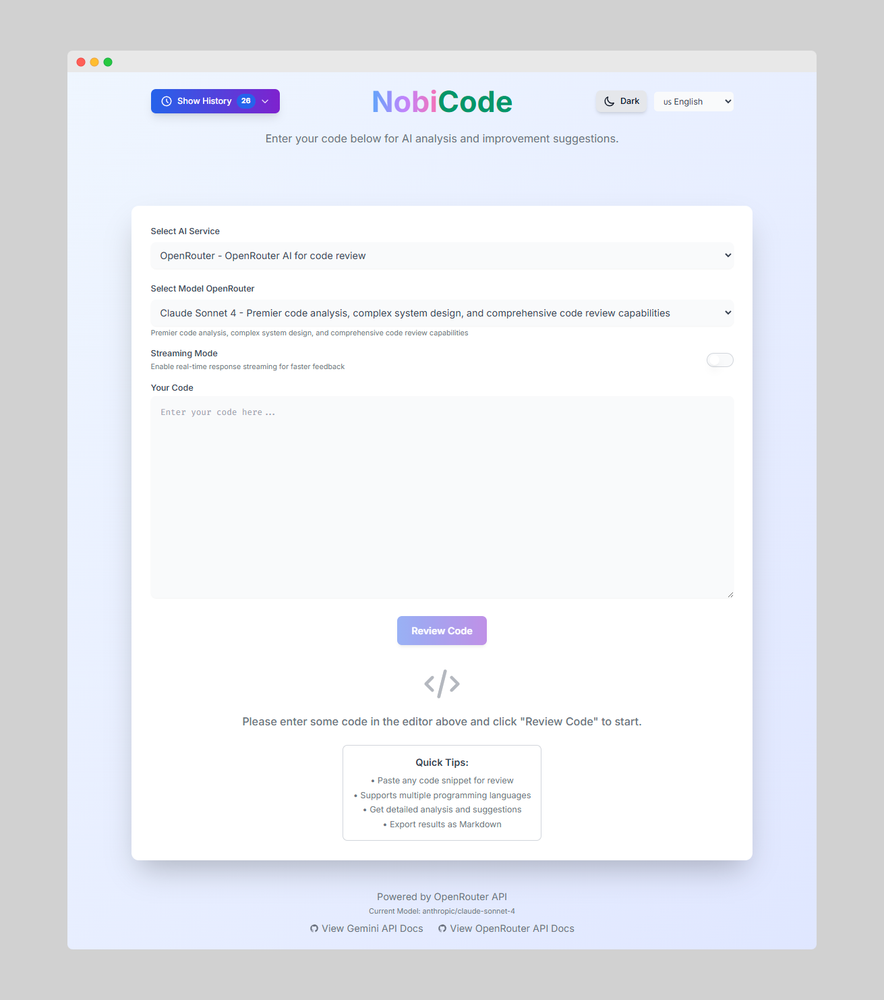
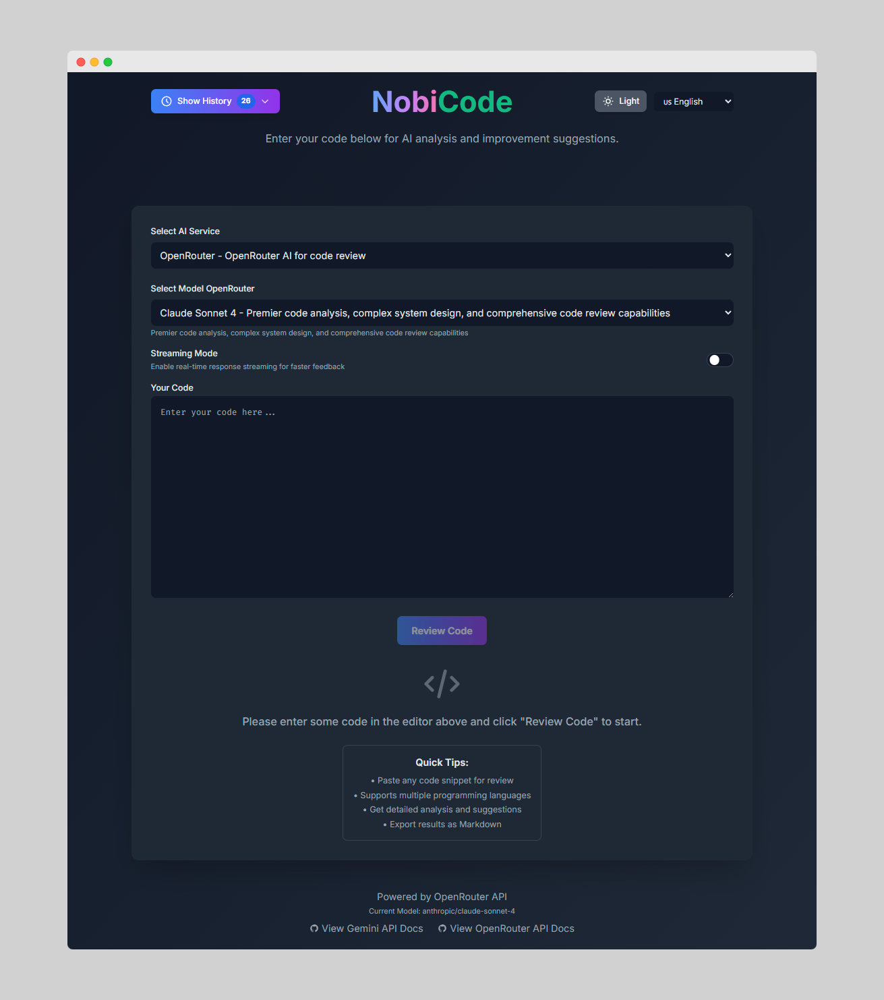

# NobiCode 🚀

**An intelligent multilingual AI-powered code review tool that helps developers improve code quality through automated analysis and detailed feedback.**

> 🤖 **AI-Generated Project**: This entire project was created using **Vibe Coding** - a development approach where AI writes 100% of the code. From architecture design to implementation, every line of code, component, and feature was generated through AI collaboration, showcasing the power of modern AI-assisted development.

[](https://opensource.org/licenses/MIT)
[](https://github.com/Nobhokleng/nobicode)
[](https://www.typescriptlang.org/)
[](https://reactjs.org/)
[](https://vitejs.dev/)

## ✨ Features

### 🤖 **Multiple AI Services**

#### **Gemini AI Integration** (Direct Google API)
- **Gemini 2.5 Pro Preview** - Advanced code architecture design, complex debugging, and enterprise-level code reviews
- **Gemini 2.5 Flash Preview** - Reliable code generation, refactoring, and algorithm optimization with fast response
- **Gemini 2.0 Flash** - Quick code fixes, syntax help, and basic programming assistance at minimal cost

#### **OpenRouter Integration** (Access to Multiple AI Providers)
- **GPT-4o Mini** - Solid code completion, bug fixing, and documentation generation at low cost
- **Deepseek V3** - Specialized in code understanding, multi-language support, and technical problem solving
- **Claude Sonnet 4** - Premier code analysis, complex system design, and comprehensive code review capabilities
- **Claude 3.7 Sonnet** - Deep code analysis, advanced debugging, and comprehensive software architecture guidance
- **Gemini 2.5 Pro Preview** (via OpenRouter) - Advanced code architecture design and enterprise-level reviews
- **Gemini 2.5 Flash Preview** (via OpenRouter) - Fast code generation and algorithm optimization
- **Gemini 2.0 Flash** (via OpenRouter) - Quick fixes and basic programming assistance

#### **Model Selection Guide**
- **For Complex Projects**: Gemini 2.5 Pro Preview, Claude Sonnet 4, Claude 3.7 Sonnet
- **For Fast Development**: Gemini 2.5 Flash Preview, Deepseek V3
- **For Cost-Effective Reviews**: Gemini 2.0 Flash, GPT-4o Mini
- **For Multi-Language Projects**: Deepseek V3, Claude models

### 🌐 **Multilingual Support**
- **UI Languages**: English (default) - optimized for accessibility and user preference
- **AI Response Languages**: English, Khmer, Spanish, French, Chinese, Japanese, Korean, Vietnamese, Thai
- **Intelligent Localization**: Language-specific prompts with English technical instructions for optimal code review quality
- **Translation Strategy**: Code review prompts written in English for better analysis, with output translated to target language

### ⚡ **Real-time Streaming**
- **Live Response Streaming**: See code review results appear in real-time
- **Progressive Display**: Proper markdown rendering during streaming
- **Cancellable Requests**: Stop analysis at any time
- **Performance Optimized**: RequestAnimationFrame batching for smooth UX

### 💾 **Persistent History**
- **Local Storage**: Review history saved in browser storage
- **History Management**: View, delete, and clear review history
- **Export Functionality**: Export reviews as Markdown
- **Warning System**: Notifications when approaching storage limits

### 🎨 **Modern UI/UX**
- **Dark/Light Theme**: Comprehensive theme switching
- **Responsive Design**: Works on desktop and mobile devices
- **Sticky Header**: Smooth navigation experience
- **Accessibility**: Keyboard navigation and screen reader support

## 🛠️ **Technology Stack**

- **Frontend**: React 19, TypeScript, Vite
- **Styling**: Tailwind CSS with custom theme system
- **AI Integration**: Google Gemini API, OpenRouter API
- **Markdown**: React Markdown with syntax highlighting
- **State Management**: React hooks with local storage persistence

## 🚀 **Quick Start**

### Prerequisites
- Node.js (v16 or higher)
- npm or yarn

### Installation

1. **Clone the repository**
   ```bash
   git clone https://github.com/yourusername/nobicode.git
   cd nobicode
   ```

2. **Install dependencies**
   ```bash
   npm install
   ```

3. **Configure API keys**
   Create a `.env.local` file in the root directory:
   ```env
   GEMINI_API_KEY=your_gemini_api_key
   OPENROUTER_API_KEY=your_openrouter_api_key
   ```
   - You can use either service or both
   - **Security Note**: This is a client-side app for development/demo purposes. In production, consider using a backend proxy to protect your API keys.

4. **Run the application**
   ```bash
   npm run dev
   ```

5. **Build for production**
   ```bash
   npm run build
   ```

## 📋 **Use Cases**

- **Code Quality Assurance**: Automated detection of bugs, performance issues, and security vulnerabilities
- **Learning Tool**: Get detailed explanations and best practice suggestions
- **Team Reviews**: Consistent code review standards across development teams
- **Multi-language Projects**: Support for various programming languages and human languages
- **Educational**: Perfect for students learning programming best practices

## 🔧 **Configuration**

### AI Provider Setup

#### Gemini API (Direct Integration)
1. Visit [Google AI Studio](https://makersuite.google.com/app/apikey)
2. Create a new API key
3. Add it to your `.env.local` file as `GEMINI_API_KEY`
4. **Benefits**: Direct access, potentially lower latency, Google's latest models
5. **Constraints**: Requires separate API key, limited to Gemini models only

#### OpenRouter API (Multi-Provider Access)
1. Visit [OpenRouter](https://openrouter.ai/keys)
2. Create a new API key
3. Add it to your `.env.local` file as `OPENROUTER_API_KEY`
4. **Benefits**: Access to multiple AI providers (OpenAI, Anthropic, Google, Deepseek), unified billing
5. **Constraints**: Additional service layer, potential slight latency increase

### Application Settings
- **Service Selection**: Choose between Gemini (direct) and OpenRouter (multi-provider)
- **Model Configuration**: Select specific models optimized for code review tasks
- **Language Preferences**: Set UI language (English/Khmer) and AI response language (9 supported languages)
- **Streaming Options**: Enable/disable real-time response streaming with markdown rendering
- **Cost Optimization**: Models are described with cost-effectiveness indicators to help selection

### Service Constraints & Limitations
- **API Keys**: You can use either service independently or both simultaneously
- **Model Availability**: Some models may have usage limits or require specific API tiers
- **Streaming Support**: All models support streaming for real-time feedback
- **Language Processing**: All models can handle code in any programming language
- **Response Languages**: AI responses can be provided in 9 human languages with quality optimizations

## 🌟 **Why NobiCode?**

- **Cost-Effective Model Selection**: Choose from 10+ AI models with clear cost-effectiveness indicators
  - Budget-friendly options: Gemini 2.0 Flash, GPT-4o Mini
  - Premium options: Claude Sonnet 4, Gemini 2.5 Pro Preview
  - Specialized options: Deepseek V3 for multi-language projects
- **Multiple AI Service Support**: Maintain access to both Gemini and OpenRouter simultaneously
- **Developer-Friendly**: Built by developers, for developers with intuitive UX and comprehensive model descriptions
- **Privacy-Focused**: Client-side application with local storage - your code stays private
- **Intelligent Language Support**: Optimized prompts for better code review quality across 9 languages
- **Extensible Architecture**: Easy to add new AI providers and languages without replacing existing services
- **Open Source**: Transparent, customizable, and community-driven
- **Multi-Platform**: Works on any device with a modern web browser

## 📸 **Screenshots**

### Main Interface
| Light Mode | Dark Mode |
|------------|-----------|
|  |  |

### AI Service Configuration
| Service Selection | Model Selection |
|-------------------|-----------------|
|  |  |

### Code Review in Action
| Code Input | Streaming Review | Completed Review |
|------------|------------------|------------------|
|  |  |  |

### Multilingual Support
| Language Selection | Multilingual Output |
|--------------------|---------------------|
|  |  |

### History Management
| History Panel | Export Feature |
|---------------|----------------|
|  |  |

### Mobile Responsive Design
| Mobile Interface | Mobile Menu |
|------------------|-------------|
|  |  |

> 📁 **View all screenshots**: [screenshots folder](screenshots/) contains detailed documentation and all interface captures.

## 🔄 **Development**

### Project Structure
```
nobicode/
├── components/             # React components
├── services/              # AI service integrations
├── constants/             # Configuration and translations
├── types/                 # TypeScript type definitions
├── utils/                 # Utility functions
├── contexts/              # React contexts
├── screenshots/           # Application screenshots and documentation
├── public/                # Static assets (index.html)
└── dist/                  # Build output
```

### Available Scripts
- `npm run dev` - Start development server
- `npm run build` - Build for production
- `npm run preview` - Preview production build

### Contributing Guidelines
1. Fork the repository
2. Create a feature branch (`git checkout -b feature/amazing-feature`)
3. Commit your changes (`git commit -m 'Add some amazing feature'`)
4. Push to the branch (`git push origin feature/amazing-feature`)
5. Open a Pull Request

## 🐛 **Troubleshooting**

### Common Issues

**API Key Not Working**
- Ensure your API keys are correctly set in `.env.local`
- Check that the API keys have the necessary permissions
- Verify the API key format is correct
- **Gemini**: Use `GEMINI_API_KEY` for direct Google API access
- **OpenRouter**: Use `OPENROUTER_API_KEY` for multi-provider access

**Model Selection Issues**
- Some models may require specific API tiers or have usage limits
- Try switching to a different model if one is unavailable
- Budget-friendly alternatives: Gemini 2.0 Flash, GPT-4o Mini
- Premium alternatives: Claude Sonnet 4, Gemini 2.5 Pro Preview

**Streaming Not Working**
- Check your internet connection
- All models support streaming - try switching models if issues persist
- Try disabling and re-enabling streaming mode
- Clear browser cache if streaming appears stuck

**Language/Translation Issues**
- AI responses support 9 languages with optimized prompts
- UI language limited to English and Khmer for optimal user experience
- Code review quality is optimized when using English technical instructions

**UI Not Loading**
- Clear browser cache and local storage
- Check browser console for errors
- Ensure you're using a modern browser
- Verify that at least one API key is configured

## 📄 **License**

This project is licensed under the MIT License - see the [LICENSE](LICENSE) file for details.

## 🤝 **Contributing**

Contributions are welcome! Please feel free to submit a Pull Request. For major changes, please open an issue first to discuss what you would like to change.

### Areas for Contribution
- Additional AI service integrations
- New language translations
- UI/UX improvements
- Performance optimizations
- Documentation improvements

## 📞 **Support**

- **Issues**: [GitHub Issues](https://github.com/Nobhokleng/nobicode/issues)
- **Discussions**: [GitHub Discussions](https://github.com/Nobhokleng/nobicode/discussions)
- **Documentation**: Check this README and inline code comments

## 🙏 **Acknowledgments**

- **AI Development**: This project demonstrates the capabilities of **Vibe Coding** - 100% AI-generated development
- **Augment Code**: For providing the AI development platform that made this project possible
- Google Gemini AI for powerful code analysis capabilities
- OpenRouter for providing access to multiple AI models
- The React and TypeScript communities for excellent tooling
- All contributors who help improve this project

## 🔮 **Roadmap**

- [ ] **Enhanced Model Constraints**: Add token limits, cost tracking, and usage analytics per model
- [ ] **Additional AI Service Integrations**: Expand OpenRouter model selection while maintaining existing services
- [ ] **Cost Optimization Features**: Real-time cost estimation and budget tracking across all services
- [ ] **Advanced Language Support**: Expand UI language options while maintaining quality standards
- [ ] **Code Diff Analysis**: Compare code versions with constraint-aware model selection
- [ ] **Team Collaboration**: Multi-user features with service and model preferences
- [ ] **Plugin System**: Custom analyzers with service-specific optimizations
- [ ] **Desktop Application**: Electron app with enhanced API key security
- [ ] **VS Code Extension**: Direct integration with constraint-aware model selection

---

**Made with ❤️ for the developer community**

*Star ⭐ this repository if you find it helpful!*
